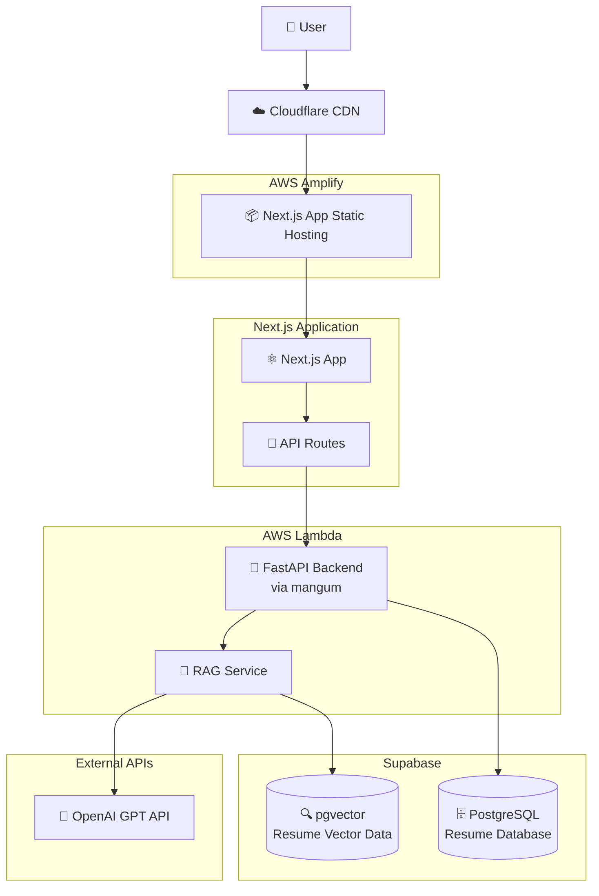

# Resume Website with AI Q&A

## Introduction

A website that showcases my personal experience and technical skills.

## Features

*   **Dynamic Resume Display**: Presents personal, education, work experience, projects, and skills sections.
*   **Interactive AI Q&A**: Allows users to ask questions about the resume content, powered by a RAG (Retrieval-Augmented Generation) system.
*   **Dual RAG Implementation**: 
    - **Supabase + LangChain Mode**: Production-ready with pgvector and LangChain integration (recommended)
*   **Advanced Observability**: Full integration with Langfuse for tracking LLM costs, latency, and quality metrics
*   **Supabase Integration**: Utilizes Supabase as the primary database for storing structured resume data.
*   **Modular Architecture**: Separates frontend (Next.js) and backend (FastAPI) for maintainability and scalability.

## System Architecture


```mermaid
graph TB
    %% User Layer
    User[👤 User]
    
    %% CDN Layer
    CloudflareCDN[☁️ Cloudflare CDN]
    
    %% Frontend Layer
    subgraph "AWS Amplify"
        StaticHost[📦 Next.js App Static Hosting]
    end
    
    %% Application Layer
    subgraph "Next.js Application"
        NextApp[⚛️ Next.js App]
        APIRoutes[🔌 API Routes]
    end
    
    %% Lambda Layer
    subgraph "AWS Lambda"
        FastAPI[🐍 FastAPI Backend<br/>via mangum]
        RAGService[🤖 RAG Service]
    end
    
    %% Database Layer
    subgraph "Supabase"
        PostgreSQL[(🗄️ PostgreSQL<br/>Resume Database)]
        pgVector[(🔍 pgvector<br/>Resume Vector Data)]
    end
    
    %% External Services
    subgraph "External APIs"
        OpenAI[🧠 OpenAI GPT API]
    end
    
    %% Data Flow Connections
    User --> CloudflareCDN
    CloudflareCDN --> StaticHost
    StaticHost --> NextApp
    NextApp --> APIRoutes
    APIRoutes --> FastAPI
    FastAPI --> RAGService
    RAGService --> OpenAI
    RAGService --> pgVector
    FastAPI --> PostgreSQL
```

## Project Architecture

-   Frontend (`src/nextjs`): Next.js App Router, Tailwind CSS. Provides resume pages and the `ChatWidget` chat interface.
-   Backend (`src/python-backend`): FastAPI exposes `/rag/query` and optional `/api/resume`.
    -   `rag.py`: RAG pipeline (OpenAI Embeddings + in-memory retrieval + Chat Completions).
    -   `main.py`: FastAPI app, CORS, optional Supabase resume API, AWS Lambda handler (Mangum).
-   Data and Types:
    -   Resume data: `src/nextjs/data/resume.json` (default source for RAG)
    -   Type definitions: `src/nextjs/types/`, `src/nextjs/lib/types.ts`
-   Docs and Deployment: `doc/` (design and AWS Amplify deployment notes), `Dockerfile`

```text
resume_website/
  ├─ src/
  │  ├─ nextjs/            # Frontend Next.js + Tailwind
  │  └─ python-backend/    # Backend FastAPI + RAG
  └─ doc/                  # Docs: design, deployment, data model
```

## Tech Stack

-   **Languages**: TypeScript, Python
-   **Frontend**: Next.js (App Router), React, Tailwind CSS
-   **Backend**: FastAPI, Uvicorn, Mangum (AWS Lambda)
-   **AI/LLM**: OpenAI API (Chat Completions, Embeddings), LangChain
-   **Database**: Supabase (Postgres, optional, used by the resume API)
-   **Vector Storage**: Supabase pgvector 
-   **Observability**: Langfuse (cost tracking, performance monitoring, quality metrics)
-   **Tooling**: Node.js, npm / Yarn, Python, pip
-   **Cloud/Deploy**: AWS Amplify (see `doc/deploy/`), Docker

## Detailed Setup and Installation

Follow these steps to get the project up and running on your local machine.

### Prerequisites

Make sure you have the following installed:

*   **Node.js** (LTS version) & **npm** (or Yarn)
*   **Python** (3.8+) & **pip**
*   **Git**

### 1. Clone the Repository

```bash
git clone https://github.com/yihsuan1102/yihsuan1102-AI-powered-Interactive-Resume-Website.git
cd resume_website
```

### 2. Database Setup

Please refer to [doc/design/Data_model.md](doc/design/Data_model.md) for complete database setup instructions, including:
- Database schema and table structures
- Supabase project creation and configuration  
- SQL commands for creating tables and indexes
- Row Level Security (RLS) policies
- Initial data insertion guidelines


### 3. Backend Setup (FastAPI)

1.  **Navigate to Backend Directory**：
    ```bash
    cd src/python-backend
    ```
2.  **Create `.env` File**: Copy the example file and configure:
    ```bash
    cp .env.example .env
    ```
    Fill the required environment variables.

3.  **Install Dependencies**：
    ```bash
    pip install -r requirements.txt
    ```
4.  **Run the Backend Server**：
    ```bash
    uvicorn main:app --reload
    ```
    The FastAPI backend will start, typically accessible at `http://127.0.0.1:8000`.

### 4. Frontend Setup (Next.js)

1.  **Navigate to Frontend Directory**：
    ```bash
    cd src/nextjs
    ```
2.  **Install Dependencies**：
    ```bash
    npm install # or yarn install
    ```
3.  **Run the Development Server**：
    ```bash
    npm run dev # or yarn dev
    ```
    The Next.js frontend will start, typically accessible at `http://localhost:3000`.

### 5. LangChain + Langfuse Integration Setup

This project now supports advanced RAG capabilities with full observability. See [doc/design/LangChain_Langfuse_Setup.md](doc/design/LangChain_Langfuse_Setup.md) for detailed setup instructions.

#### Quick Start:

1. **Set up Langfuse Cloud**:
   - Visit [Langfuse Cloud](https://cloud.langfuse.com) and create an account
   - Create a new project for your resume chatbot
   - Copy your Public Key (`pk_xxx`) and Secret Key (`sk_xxx`)

2. **Configure Environment Variables**:
   ```bash
   # In src/python-backend/.env
   LANGFUSE_PUBLIC_KEY=pk_your-langfuse-public-key
   LANGFUSE_SECRET_KEY=sk_your-langfuse-secret-key
   USE_LANGCHAIN_RAG=true  # Enable LangChain mode
   ```

3. **Test the Integration**:
   ```bash
   cd src/python-backend
   python test_integration.py
   ```

#### Features:
- **Cost Tracking**: Monitor OpenAI API costs per query
- **Performance Monitoring**: Track latency for embeddings and generation
- **Quality Metrics**: Analyze retrieval effectiveness and answer quality
- **Usage Analytics**: Understand user query patterns and popular topics

#### RAG Mode Configuration:
- **Supabase + LangChain** (`USE_LANGCHAIN_RAG=true`): Production-ready using existing pgvector data with LangChain integration
- **Legacy Mode** (`USE_LANGCHAIN_RAG=false`): Original implementation with Langfuse decorators (fallback)

For detailed Supabase integration setup, see [doc/design/Supabase_LangChain_Integration.md](doc/design/Supabase_LangChain_Integration.md)
