# Resume Website with AI Q&A

## Introduction

A website that showcases my personal experience and technical skills.

## Features

*   **Dynamic Resume Display**: Presents personal, education, work experience, projects, and skills sections.
*   **Interactive AI Q&A**: Allows users to ask questions about the resume content, powered by a RAG (Retrieval-Augmented Generation) system.
*   **Supabase Integration**: Utilizes Supabase as the primary database for storing structured resume data.
*   **Modular Architecture**: Separates frontend (Next.js) and backend (FastAPI) for maintainability and scalability.

## System Architecture

```mermaid
graph TB
    %% User Layer
    User[👤 User]
    
    %% CDN Layer
    CloudflareCDN[☁️ Cloudflare CDN]
    
    %% Frontend Layer
    subgraph "AWS Amplify"
        StaticHost[📦 Next.js App Static Hosting]
    end
    
    %% Application Layer
    subgraph "Next.js Application"
        NextApp[⚛️ Next.js App]
        APIRoutes[🔌 API Routes]
    end
    
    %% Lambda Layer
    subgraph "AWS Lambda"
        FastAPI[🐍 FastAPI Backend<br/>via mangum]
        RAGService[🤖 RAG Service]
    end
    
    %% Database Layer
    subgraph "Supabase"
        PostgreSQL[(🗄️ PostgreSQL<br/>Resume Database)]
        pgVector[(🔍 pgvector<br/>Resume Vector Data)]
    end
    
    %% External Services
    subgraph "External APIs"
        OpenAI[🧠 OpenAI GPT API]
    end
    
    %% Data Flow Connections
    User --> CloudflareCDN
    CloudflareCDN --> StaticHost
    StaticHost --> NextApp
    NextApp --> APIRoutes
    APIRoutes --> FastAPI
    FastAPI --> RAGService
    RAGService --> OpenAI
    RAGService --> pgVector
    FastAPI --> PostgreSQL
```



## Project Architecture

-   Frontend (`src/nextjs`): Next.js App Router, Tailwind CSS. Provides resume pages and the `ChatWidget` chat interface.
-   Backend (`src/python-backend`): FastAPI exposes `/rag/query` and optional `/api/resume`.
    -   `rag.py`: RAG pipeline (OpenAI Embeddings + in-memory retrieval + Chat Completions).
    -   `main.py`: FastAPI app, CORS, optional Supabase resume API, AWS Lambda handler (Mangum).
-   Data and Types:
    -   Resume data: `src/nextjs/data/resume.json` (default source for RAG)
    -   Type definitions: `src/nextjs/types/`, `src/nextjs/lib/types.ts`
-   Docs and Deployment: `doc/` (design and AWS Amplify deployment notes), `Dockerfile`

```text
resume_website/
  ├─ src/
  │  ├─ nextjs/            # Frontend Next.js + Tailwind
  │  └─ python-backend/    # Backend FastAPI + RAG
  └─ doc/                  # Docs: design, deployment, data model
```

## Tech Stack

-   **Languages**: TypeScript, Python
-   **Frontend**: Next.js (App Router), React, Tailwind CSS
-   **Backend**: FastAPI, Uvicorn, Mangum (AWS Lambda)
-   **AI/LLM**: OpenAI API (Chat Completions, Embeddings)
-   **Database**: Supabase (Postgres, optional, used by the resume API)
-   **Retrieval/Vector**: OpenAI Embeddings + in-memory retrieval (no external vector DB yet)
-   **Tooling**: Node.js, npm / Yarn, Python, pip
-   **Cloud/Deploy**: AWS Amplify (see `doc/deploy/`), Docker

## Detailed Setup and Installation

Follow these steps to get the project up and running on your local machine.

### Prerequisites

Make sure you have the following installed:

*   **Node.js** (LTS version) & **npm** (or Yarn)
*   **Python** (3.8+) & **pip**
*   **Git**

### 1. Clone the Repository

```bash
git clone https://github.com/yihsuan1102/yihsuan1102-AI-powered-Interactive-Resume-Website.git
cd resume_website
```

### 2. Database Setup

Please refer to [doc/design/Data_model.md](doc/design/Data_model.md) for complete database setup instructions, including:
- Database schema and table structures
- Supabase project creation and configuration  
- SQL commands for creating tables and indexes
- Row Level Security (RLS) policies
- Initial data insertion guidelines


### 3. Backend Setup (FastAPI)

1.  **Navigate to Backend Directory**：
    ```bash
    cd src/python-backend
    ```
2.  **Create `.env` File**: Create `.env` and fill the required environment variables (optional as needed):
    ```env
    # OpenAI and model
    OPENAI_API_KEY=YOUR_OPENAI_API_KEY
    OPENAI_MODEL=gpt-5-nano                 # optional; defaults to gpt-5-nano

    # RAG and frontend CORS
    ALLOWED_ORIGINS=http://localhost:3000   # comma-separated list
    RAG_API_KEY=YOUR_RAG_API_KEY            # optional; if set, clients must send X-API-Key header

    # Resume data source (defaults to src/nextjs/data/resume.json)
    RESUME_JSON_PATH=../nextjs/data/resume.json

    # Supabase (optional; used by /api/resume)
    SUPABASE_URL=YOUR_SUPABASE_URL
    SUPABASE_KEY=YOUR_SUPABASE_KEY
    ```
3.  **Install Dependencies**：
    ```bash
    pip install -r requirements.txt
    ```
4.  **Run the Backend Server**：
    ```bash
    uvicorn main:app --reload
    ```
    The FastAPI backend will start, typically accessible at `http://127.0.0.1:8000`.

### 4. Frontend Setup (Next.js)

1.  **Navigate to Frontend Directory**：
    ```bash
    cd src/nextjs
    ```
2.  **Install Dependencies**：
    ```bash
    npm install # or yarn install
    ```
3.  **Run the Development Server**：
    ```bash
    npm run dev # or yarn dev
    ```
    The Next.js frontend will start, typically accessible at `http://localhost:3000`.
