# System Architecture Diagram - AI-Powered Interactive Resume Website

## Data Flow Diagrams

```mermaid
graph TB
    %% 用戶層
    User[👤 用戶]
    
    %% CDN層
    CloudflareCDN[☁️ Cloudflare CDN]
    
    %% 前端層
    subgraph "AWS Amplify"
        StaticHost[📦 Next.js App 靜態託管]
    end
    
    %% 應用層
    subgraph "Next.js 應用"
        NextApp[⚛️ Next.js App]
        APIRoutes[🔌 API Routes]
    end
    
    %% Lambda層
    subgraph "AWS Lambda"
        FastAPI[🐍 FastAPI Backend<br/>via mangum]
        RAGService[🤖 RAG Service]
    end
    
    %% 資料庫層
    subgraph "Supabase"
        PostgreSQL[(🗄️ PostgreSQL<br/>履歷資料庫)]
        pgVector[(🔍 pgvector<br/>履歷向量資料)]
    end
    
    %% 外部服務
    subgraph "External APIs"
        OpenAI[🧠 OpenAI GPT API]
    end
    
    %% 資料流程連線
    User --> CloudflareCDN
    CloudflareCDN --> StaticHost
    StaticHost --> NextApp
    NextApp --> APIRoutes
    APIRoutes --> FastAPI
    FastAPI --> RAGService
    RAGService --> OpenAI
    RAGService --> pgVector
    FastAPI --> PostgreSQL
```



## 資料流程圖

### 1. 用戶瀏覽履歷流程

```mermaid
sequenceDiagram
    participant U as 👤 用戶
    participant CF as ☁️ Cloudflare CDN
    participant AM as 🚀 AWS Amplify
    participant NA as ⚛️ Next.js App
    participant SB as 🗄️ Supabase DB
    
    Note over U,SB: 用戶瀏覽履歷資料流程
    
    U->>+CF: 1. 訪問履歷網站
    CF->>+AM: 2. 請求靜態資源
    AM->>+NA: 3. 載入 Next.js 應用
    NA->>+SB: 4. 查詢履歷資料
    SB-->>-NA: 5. 返回履歷結構化資料
    NA-->>-AM: 6. 渲染履歷頁面 (SSR/SSG)
    AM-->>-CF: 7. 返回完整頁面
    CF-->>-U: 8. 展示完整履歷網站
    
    Note over U: 用戶可瀏覽：<br/>• 個人資訊<br/>• 工作經驗<br/>• 技能專長<br/>• 專案作品
```



### 2. AI問答RAG流程


## Core Components Description

### ☁️ Cloudflare CDN
- **Global Content Delivery Network**: Accelerates static resource loading with edge caching

### 🚀 AWS Amplify
- **Next.js App Static Hosting**: Hosts Next.js build static files

### ⚛️ Next.js Application
- **SSR/SSG**: Server-side rendering, SEO-friendly
- **API Routes**: Lightweight API endpoints

### 🐍 AWS Lambda + FastAPI
- **Serverless**: On-demand execution, cost-effective
- **mangum**: FastAPI to Lambda adapter
- **RAG Service**: Retrieval-Augmented Generation service

### 🗄️ Supabase Data Layer
- **PostgreSQL**: Structured resume data storage
- **pgvector**: Resume content vectorization storage, supports semantic search


### 🧠 OpenAI Integration
- **Embedding**: Question and resume content vectorization
- **GPT API**: Context-based intelligent response generation

## Database Design

### Resume Data Table (resume_data)
```sql
-- Structured resume data
CREATE TABLE resume_data (
  id UUID PRIMARY KEY,
  user_id VARCHAR(50),
  section VARCHAR(50), -- 'experience', 'skills', 'projects'
  content JSONB,       -- Structured resume content
  created_at TIMESTAMP,
  updated_at TIMESTAMP
);
```

### Resume Vectors Table (resume_vectors)
```sql
-- Vectorized resume content
CREATE TABLE resume_vectors (
  id UUID PRIMARY KEY,
  content TEXT,        -- Original text content
  embedding VECTOR(1536), -- OpenAI embedding vector
  metadata JSONB,      -- Related metadata (section, tags, etc.)
  resume_id UUID REFERENCES resume_data(id),
  created_at TIMESTAMP
);

-- Vector similarity index
CREATE INDEX ON resume_vectors USING ivfflat (embedding vector_cosine_ops);
```
。